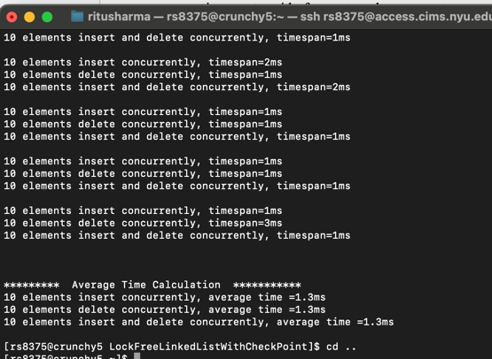

# LockFreeLinkedList with Checkpoint Approach

## Overview
This project implements a works on top of our main project in this we have used checkpoint approach where we store the position of the pointer and in most of the cases there's high probability that we see performance when we store curr pointer.
- **PS : This is not our main project this is just an enhancement over our main project. Main project is - MultiCore.zip**
## Features
- **Concurrent Insertions:** Allows multiple threads to insert elements into the linked list concurrently.
- **Concurrent Deletions:** Supports the removal of elements from the list by multiple threads at the same time.

## Dependencies
- MakeFile (for building the project)
- POSIX Threads (for threading support)

## Building the Project
To build the project, follow these steps:
1. Navigate to the project directory:
   ```
   cd LockfreelinkedlistWithCheckPoint
   ```
3. Use make command to build executable of the project:
   ```
   make
   ```

## Running the Tests
After building the project, you can run the tests to see the performance of the lock-free linked list:
```
./lockFreeLinkedListWithCheckPoint 100 1000 10000 4
```
This command runs the test with 100, 1000, and 10000 elements and uses 4 threads or you can also define noOfThreads = std::thread::hardware_concurrency() to take as logical cores we have.
  
## Proof of build on crunch5


## License
This project is licensed under the MIT License - see the LICENSE file for details.
